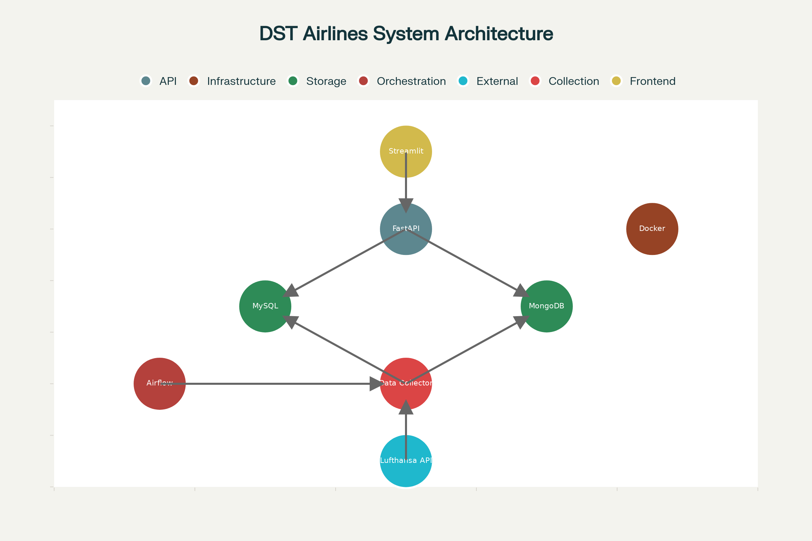

# 🛩️ DST Airlines - Data Engineering Project

A comprehensive data engineering pipeline for flight data management using Lufthansa API, featuring microservices architecture with Docker containers.

## 🚀 Quick Start

```bash
# Clone repository
git clone https://github.com/YOUR_USERNAME/dst-airlines.git
cd dst-airlines

# Setup environment
cp .env.example .env
# Edit .env with your Lufthansa API credentials

# Start all services
make up

# Access applications
# Dashboard: http://localhost:8501
# API Docs: http://localhost:8000/docs
# Airflow: http://localhost:8080
```

## 📋 Project Overview

This project implements a complete data engineering pipeline that:
- 📡 **Collects** flight and airport data from Lufthansa API
- 🗄️ **Stores** data in both MySQL (relational) and MongoDB (NoSQL)
- 🔌 **Exposes** data through FastAPI REST endpoints
- 📊 **Visualizes** insights in an interactive Streamlit dashboard
- 🐳 **Containerizes** all components using Docker
- ⚡ **Orchestrates** workflows with Apache Airflow

## 🏗️ Architecture



### Components

| Service | Technology | Port | Purpose |
|---------|------------|------|---------|
| **API** | FastAPI | 8000 | REST API for data access |
| **Dashboard** | Streamlit | 8501 | Interactive web interface |
| **Data Collector** | Python/Schedule | - | Automated data collection |
| **MySQL** | MySQL 8.0 | 3306 | Relational data storage |
| **MongoDB** | MongoDB 7.0 | 27017 | NoSQL data storage |
| **Airflow** | Apache Airflow | 8080 | Workflow orchestration |

## 📁 Project Structure

```
dst-airlines/
├── 🔌 api/                     # FastAPI backend
│   ├── models/                 # Database models
│   ├── routers/                # API endpoints
│   └── utils/                  # Utility functions
├── 📊 dashboard/               # Streamlit frontend
│   ├── pages/                  # Dashboard pages
│   └── components/             # Reusable components
├── 📥 data-collector/          # Data collection service
├── 🗄️ databases/               # Database configurations
├── ⚡ airflow/                 # Airflow DAGs
├── 🧪 tests/                   # Test suites
└── 🐳 docker-compose.yml       # Container orchestration
```

## 🛠️ Technology Stack

### Backend
- **FastAPI** - Modern Python web framework
- **SQLAlchemy** - SQL toolkit and ORM
- **Pydantic** - Data validation using Python type annotations

### Frontend
- **Streamlit** - Interactive web applications
- **Plotly** - Interactive data visualization
- **Pandas** - Data manipulation and analysis

### Databases
- **MySQL** - Relational database for structured data
- **MongoDB** - NoSQL database for flexible schemas

### Infrastructure
- **Docker** - Containerization
- **Docker Compose** - Multi-container orchestration
- **Apache Airflow** - Workflow orchestration

### External APIs
- **Lufthansa API** - Flight and airport data source

## ⚡ Quick Commands

```bash
# Development
make up              # Start all services
make down            # Stop all services
make logs            # View logs
make test            # Run tests
make clean           # Clean up containers

# Database
make db-init         # Initialize databases
make backup          # Backup database
make health          # Check service health

# Development mode (without Docker)
make dev-api         # Run API locally
make dev-dashboard   # Run dashboard locally
```

## 📊 Features

### 🔍 Data Collection
- ✅ Automated collection from Lufthansa API
- ✅ Real-time flight status updates
- ✅ Airport and airline information
- ✅ Scheduled data synchronization

### 💾 Data Storage
- ✅ Dual database architecture (MySQL + MongoDB)
- ✅ Data validation and cleaning
- ✅ Historical data preservation
- ✅ Backup and recovery

### 🔌 API Layer
- ✅ RESTful API with OpenAPI/Swagger docs
- ✅ CRUD operations for all entities
- ✅ Advanced filtering and pagination
- ✅ Health checks and monitoring

### 📈 Dashboard
- ✅ Interactive data visualization
- ✅ Real-time metrics and KPIs
- ✅ Flight route analysis
- ✅ Airport distribution maps
- ✅ Data synchronization interface

## 🚀 Getting Started

### Prerequisites
- Docker Desktop (Windows/Mac) or Docker Engine (Linux)
- Python 3.9+
- Git
- Lufthansa API credentials ([Get here](https://developer.lufthansa.com/))

### Installation

1. **Clone the repository**
   ```bash
   git clone https://github.com/YOUR_USERNAME/dst-airlines.git
   cd dst-airlines
   ```

2. **Configure environment**
   ```bash
   cp .env.example .env
   # Edit .env with your configuration
   ```

3. **Start services**
   ```bash
   make up
   ```

4. **Verify installation**
   ```bash
   make health
   ```

### 📖 Detailed Setup Guide

For complete step-by-step instructions, see [📋 Complete Setup Guide](dst-airlines-setup-guide.md)

## 🧪 Testing

```bash
# Run all tests
make test

# Run specific test suites
pytest tests/test_api.py -v
pytest tests/test_dashboard.py -v
pytest tests/test_data_collector.py -v
```

## 📈 Monitoring

### Service Health
- API: `http://localhost:8000/health`
- Dashboard: `http://localhost:8501/_stcore/health`
- Airflow: `http://localhost:8080`

### Logs
```bash
# View all logs
make logs

# View specific service logs
make logs-api
make logs-dashboard
make logs-mysql
```

## 🔧 Development

### API Development
```bash
# Start development server
cd api
uvicorn main:app --reload --host 0.0.0.0 --port 8000
```

### Dashboard Development
```bash
# Start development server
cd dashboard
streamlit run main.py --server.port 8501
```

### Database Schema Changes
```bash
# Create migration
alembic revision --autogenerate -m "description"

# Apply migrations
alembic upgrade head
```

## 🚀 Deployment

### Production Deployment
```bash
# Deploy to production
make deploy-prod

# Or manually with production compose
docker-compose -f docker-compose.yml -f docker-compose.prod.yml up -d
```

### CI/CD Pipeline
GitHub Actions workflows are configured for:
- ✅ Automated testing on PR
- ✅ Docker image building
- ✅ Production deployment on release

## 🤝 Contributing

1. Fork the repository
2. Create a feature branch (`git checkout -b feature/amazing-feature`)
3. Commit changes (`git commit -m 'Add amazing feature'`)
4. Push to branch (`git push origin feature/amazing-feature`)
5. Open a Pull Request

## 📄 API Documentation

Once running, visit:
- **Swagger UI**: `http://localhost:8000/docs`
- **ReDoc**: `http://localhost:8000/redoc`

## 🔐 Environment Variables

```env
# Lufthansa API
LUFTHANSA_CLIENT_ID=your_client_id
LUFTHANSA_CLIENT_SECRET=your_client_secret

# Database
MYSQL_HOST=localhost
MYSQL_PORT=3306
MYSQL_DATABASE=dst_airlines
MYSQL_USER=admin
MYSQL_PASSWORD=admin123

# Services
API_PORT=8000
DASHBOARD_PORT=8501
```

## 🐛 Troubleshooting

### Common Issues

1. **Docker containers not starting**
   ```bash
   make clean
   make build
   make up
   ```

2. **Database connection errors**
   ```bash
   make logs-mysql
   make health
   ```

3. **API not responding**
   ```bash
   make logs-api
   curl http://localhost:8000/health
   ```

For detailed troubleshooting, see the [Complete Setup Guide](dst-airlines-setup-guide.md#troubleshooting-guide).

## 📊 Project Timeline

| Phase | Duration | Tasks |
|-------|----------|-------|
| **Week 1-2** | Setup | Project structure, databases |
| **Week 3-4** | Backend | API development, data models |
| **Week 5-6** | Frontend | Dashboard, visualization |
| **Week 7-8** | Integration | Data collection, testing |
| **Week 9-10** | Deployment | Production setup, documentation |

## 📋 Requirements Compliance

✅ **Data Collection**: Lufthansa API integration  
✅ **Data Modeling**: MySQL + MongoDB dual storage  
✅ **Data Consumption**: FastAPI + Streamlit dashboard  
✅ **Containerization**: Docker microservices  
✅ **Automation**: Airflow orchestration  
✅ **Documentation**: Complete setup guide  

## 🎯 Project Objectives

This project demonstrates:
- Modern data engineering practices
- Microservices architecture
- API integration and data pipeline development
- Interactive dashboard creation
- Docker containerization
- CI/CD implementation
- Production deployment strategies

## 📞 Support

For questions and support:
- 📧 Create an issue in the repository
- 📚 Check the [detailed setup guide](dst-airlines-setup-guide.md)
- 💬 Review troubleshooting section

## 📜 License

This project is licensed under the MIT License - see the [LICENSE](LICENSE) file for details.

---

**Built with ❤️ for DataScientest | Data Engineering Bootcamp**